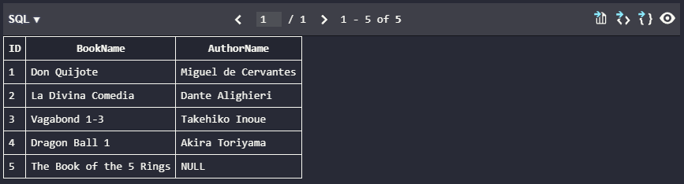
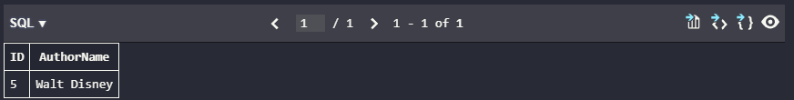
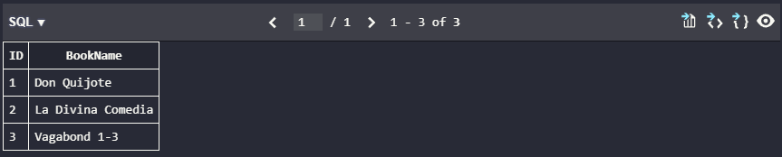
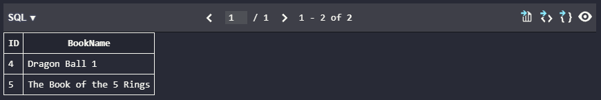
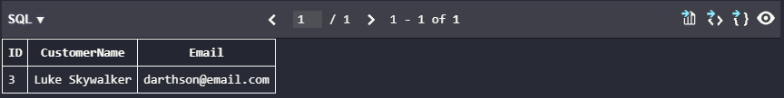
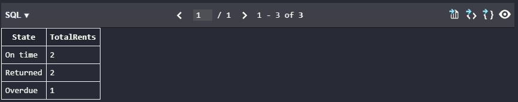

# SELECT y JOINs

# Tabla informativa

| Funcionalidad | Para que sirve | Sintaxis base | Ejemplo corto |
| --- | --- | --- | --- |
| `ORDER BY` | Ordena las filas del resultado. Si no se usa, el orden no esta garantizado. | `SELECT ... FROM ... ORDER BY columna ASC \| DESC;` | `SELECT Name FROM Books ORDER BY Name ASC;` |
| `LIMIT` | Restringe la cantidad de filas devueltas. Conviene usarlo junto con `ORDER BY` para que el subconjunto sea estable. | `SELECT ... FROM ... ORDER BY columna LIMIT n;` | `SELECT Name FROM Books ORDER BY ID LIMIT 3;` |
| `GROUP BY` | Agrupa filas con el mismo valor y normalmente se combina con funciones como `COUNT`, `SUM` o `AVG`. | `SELECT columna, COUNT(*) FROM tabla GROUP BY columna;` | `SELECT State, COUNT(*) FROM Rents GROUP BY State;` |
| `INNER JOIN` | Devuelve solo las filas que tienen coincidencia en ambas tablas. | `SELECT ... FROM A INNER JOIN B ON ...;` | `SELECT b.Name, a.Name FROM Books b INNER JOIN Authors a ON b.AuthorID = a.ID;` |
| `LEFT JOIN` | Devuelve todas las filas de la tabla izquierda y las coincidencias de la derecha. Si no hay coincidencia, la derecha queda en `NULL`. | `SELECT ... FROM A LEFT JOIN B ON ...;` | `SELECT b.Name, a.Name FROM Books b LEFT JOIN Authors a ON b.AuthorID = a.ID;` |
| `RIGHT JOIN` | Devuelve todas las filas de la tabla derecha y las coincidencias de la izquierda. Si no hay coincidencia, la izquierda queda en `NULL`. | `SELECT ... FROM A RIGHT JOIN B ON ...;` | `SELECT b.Name, a.Name FROM Books b RIGHT JOIN Authors a ON b.AuthorID = a.ID;` |

# Script para crear las tablas

```sql
DROP TABLE IF EXISTS Rents;
DROP TABLE IF EXISTS Books;
DROP TABLE IF EXISTS Customers;
DROP TABLE IF EXISTS Authors;

CREATE TABLE Authors (
    ID INT PRIMARY KEY,
    Name VARCHAR(100) NOT NULL
);

CREATE TABLE Books (
    ID INT PRIMARY KEY,
    Name VARCHAR(150) NOT NULL,
    AuthorID INT NULL,
    FOREIGN KEY (AuthorID) REFERENCES Authors(ID)
);

CREATE TABLE Customers (
    ID INT PRIMARY KEY,
    Name VARCHAR(100) NOT NULL,
    Email VARCHAR(150) NOT NULL
);

CREATE TABLE Rents (
    ID INT PRIMARY KEY,
    BookID INT NOT NULL,
    CustomerID INT NOT NULL,
    State VARCHAR(20) NOT NULL,
    FOREIGN KEY (BookID) REFERENCES Books(ID),
    FOREIGN KEY (CustomerID) REFERENCES Customers(ID)
);
```

# Inserts

```sql
INSERT INTO Authors (ID, Name) VALUES
(1, 'Miguel de Cervantes'),
(2, 'Dante Alighieri'),
(3, 'Takehiko Inoue'),
(4, 'Akira Toriyama'),
(5, 'Walt Disney');

INSERT INTO Books (ID, Name, AuthorID) VALUES
(1, 'Don Quijote', 1),
(2, 'La Divina Comedia', 2),
(3, 'Vagabond 1-3', 3),
(4, 'Dragon Ball 1', 4),
(5, 'The Book of the 5 Rings', NULL);

INSERT INTO Customers (ID, Name, Email) VALUES
(1, 'John Doe', 'j.doe@email.com'),
(2, 'Jane Doe', 'jane@doe.com'),
(3, 'Luke Skywalker', 'darthson@email.com');

INSERT INTO Rents (ID, BookID, CustomerID, State) VALUES
(1, 1, 2, 'Returned'),
(2, 2, 2, 'Returned'),
(3, 1, 1, 'On time'),
(4, 3, 1, 'On time'),
(5, 2, 2, 'Overdue');
```

# Ejercicios

# 1. Obtener todos los libros y sus autores, en caso de tenerlos

```sql
SELECT
    b.ID,
    b.Name AS BookName,
    a.Name AS AuthorName
FROM Books b
LEFT JOIN Authors a
    ON b.AuthorID = a.ID
ORDER BY b.ID;
```

Resultado esperado:

| ID | BookName | AuthorName |
| --- | --- | --- |
| 1 | Don Quijote | Miguel de Cervantes |
| 2 | La Divina Comedia | Dante Alighieri |
| 3 | Vagabond 1-3 | Takehiko Inoue |
| 4 | Dragon Ball 1 | Akira Toriyama |
| 5 | The Book of the 5 Rings | NULL |



# 2. Obtener todos los libros que no tienen autor

```sql
SELECT
    b.ID,
    b.Name AS BookName
FROM Books b
LEFT JOIN Authors a
    ON b.AuthorID = a.ID
WHERE a.ID IS NULL
ORDER BY b.ID;
```

Resultado esperado:

| ID | BookName |
| --- | --- |
| 5 | The Book of the 5 Rings |


# 3. Obtener todos los autores que no tienen libros

```sql
SELECT
    a.ID,
    a.Name AS AuthorName
FROM Authors a
LEFT JOIN Books b
    ON a.ID = b.AuthorID
WHERE b.ID IS NULL
ORDER BY a.ID;
```

Resultado esperado:

| ID | AuthorName |
| --- | --- |
| 5 | Walt Disney |



# 4. Obtener todos los libros que han sido rentados en algun momento

```sql
SELECT DISTINCT
    b.ID,
    b.Name AS BookName
FROM Books b
INNER JOIN Rents r
    ON b.ID = r.BookID
ORDER BY b.ID;
```

Resultado esperado:

| ID | BookName |
| --- | --- |
| 1 | Don Quijote |
| 2 | La Divina Comedia |
| 3 | Vagabond 1-3 |



# 5. Obtener todos los libros que nunca han sido rentados

```sql
SELECT
    b.ID,
    b.Name AS BookName
FROM Books b
LEFT JOIN Rents r
    ON b.ID = r.BookID
WHERE r.ID IS NULL
ORDER BY b.ID;
```

Resultado esperado:

| ID | BookName |
| --- | --- |
| 4 | Dragon Ball 1 |
| 5 | The Book of the 5 Rings |



# 6. Obtener todos los clientes que nunca han rentado un libro

```sql
SELECT
    c.ID,
    c.Name AS CustomerName,
    c.Email
FROM Customers c
LEFT JOIN Rents r
    ON c.ID = r.CustomerID
WHERE r.ID IS NULL
ORDER BY c.ID;
```

Resultado esperado:

| ID | CustomerName | Email |
| --- | --- | --- |
| 3 | Luke Skywalker | darthson@email.com |



# 7. Obtener todos los libros que han sido rentados y estan en estado `Overdue`

```sql
SELECT DISTINCT
    b.ID,
    b.Name AS BookName,
    r.State
FROM Books b
INNER JOIN Rents r
    ON b.ID = r.BookID
WHERE r.State = 'Overdue'
ORDER BY b.ID;
```

Resultado esperado:

| ID | BookName | State |
| --- | --- | --- |
| 2 | La Divina Comedia | Overdue |


# Consulta extra con `GROUP BY`

Esta consulta no es parte de los 7 ejercicios, pero sirve para demostrar el uso de `GROUP BY` con las tablas del problema.

```sql
SELECT
    r.State,
    COUNT(*) AS TotalRents
FROM Rents r
GROUP BY r.State
ORDER BY TotalRents DESC;
```

Posible resultado:

| State | TotalRents |
| --- | --- |
| Returned | 2 |
| On time | 2 |
| Overdue | 1 |

