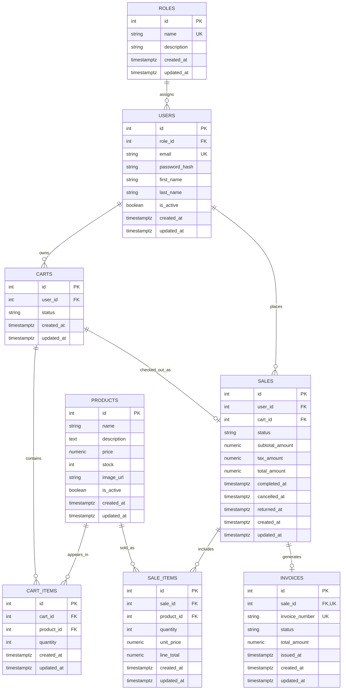

# Entity-Relationship Diagram

This diagram represents the current PostgreSQL schema used by the Flask API.



## Relationship Summary

- One role can be assigned to many users.
- One user can own many carts.
- One user can place many sales.
- One cart can contain many cart items.
- One cart can be associated with zero or one sale after checkout.
- One product can appear in many cart items.
- One product can appear in many sale items.
- One sale contains many sale items.
- One sale can generate zero or one invoice.

## Main Constraints

- `roles.name` is unique.
- `users.email` is unique.
- `products.price >= 0`.
- `products.stock >= 0`.
- `cart_items.quantity > 0`.
- `cart_items.cart_id + cart_items.product_id` is unique.
- `sales.cart_id` is unique.
- `sale_items.quantity > 0`.
- `sale_items.unit_price >= 0`.
- `sale_items.line_total >= 0`.
- `sale_items.sale_id + sale_items.product_id` is unique.
- `invoices.invoice_number` is unique.
- `invoices.sale_id` is unique.

## Status Values

- `carts.status`: `active`, `checked_out`, `abandoned`.
- `sales.status`: `completed`, `cancelled`, `returned`.
- `invoices.status`: `issued`, `cancelled`, `refunded`.

## pgAdmin Verification SQL

```sql
SELECT
    table_name,
    column_name,
    data_type,
    is_nullable
FROM information_schema.columns
WHERE table_schema = 'public'
  AND table_name IN (
      'roles',
      'users',
      'products',
      'carts',
      'cart_items',
      'sales',
      'sale_items',
      'invoices'
  )
ORDER BY table_name, ordinal_position;
```
